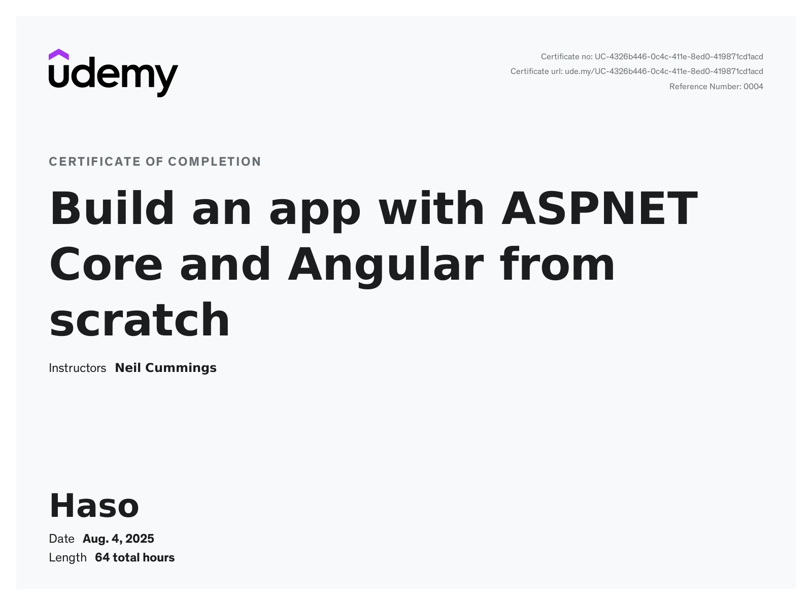

# 💘 Dating App – Built with .NET 9 & Angular 19

This is a full-stack **Dating Web Application** built as part of a Udemy course using modern and in-demand technologies like **ASP.NET Core 9.0**, **Angular 19**, **Entity Framework Core**, and **SQL Server**. Every feature was built from scratch while following best practices and a clean architecture.

---



## 🔧 Tech Stack

- **Frontend**: Angular 19, TypeScript, Bootstrap, Tailwind CSS, DaisyUI  
- **Backend**: ASP.NET Core 9.0 Web API  
- **Database**: SQL Server, Entity Framework Core  
- **Authentication**: JWT Tokens  
- **Real-Time Features**: SignalR for messaging and online presence  
- **Dev Tools**: Visual Studio Code, Angular CLI, .NET CLI, Postman  

---

## 🚀 Features

- ✅ User Registration & Login (JWT Auth)
- ✅ Profile editing with photo upload (drag & drop + cloud integration)
- ✅ User gallery and photo management
- ✅ Browse users with filtering, sorting & pagination
- ✅ Like system (match engine)
- ✅ Real-time private messaging (SignalR)
- ✅ Responsive UI with Tailwind + DaisyUI
- ✅ Angular routing with protected routes
- ✅ Template & Reactive Forms with validation
- ✅ Global error handling (API + SPA)
- ✅ Fully deployable to Azure (Free Tier)

---

## 🛠️ Getting Started

### 🔗 Prerequisites

- [.NET 9 SDK](https://dotnet.microsoft.com/download)
- [Node.js + npm](https://nodejs.org/)
- [Angular CLI](https://angular.io/cli)
- [SQL Server](https://www.microsoft.com/en-us/sql-server/)
- [Visual Studio Code](https://code.visualstudio.com/)

---

### 💻 Run Locally

```bash
# Run Backend (API)
cd API
dotnet restore
dotnet ef database update
dotnet run

# Open a new terminal and run Frontend (Angular)
cd client
npm install
ng serve
```

## 📚 What I Learned

- Building a full-stack app from scratch
- Structuring a scalable Angular app using best practices
- RESTful API design with .NET and Entity Framework
- Authentication & Authorization with JWT
- Real-time communication with SignalR
- Cloud deployment (Azure) and integration
- UI development with Tailwind, DaisyUI, and 3rd-party libraries
- Error handling and form validation in Angular

---

## 🧑‍🎓 About the Course

- **Platform**: Udemy  
- **Course Title**: *Build an app with ASPNET Core and Angular from scratch*  
- **Updated For**: .NET 9 & Angular 19 (June 2025)  
- **Instructor**: Neil Cummings  

> 🗣️ “The absolute best course for building an API in .NET Core and working with Angular!” – *Jim (Student)*  
>  
> 🗣️ “A complete, real-world project course using technologies in demand.” – *Daniyal (Student)*

---

## 📦 Deployment

The application is deployable to **Azure**:

- Backend hosted using **Azure App Service** (API)
- Angular frontend served as a **static site**

---

## 🧪 Future Improvements (Optional Ideas)

- Push notifications using service workers
- Admin panel for user moderation
- Premium subscription features
- Unit & integration tests
- CI/CD using GitHub Actions

---

## 📫 Contact

Made with ❤️ by **Hasan Rahic**  
🔗 GitHub: [@hasanrahic](https://github.com/hasanrahic)  
📧 Email: hasanrahic604@gmail.com
